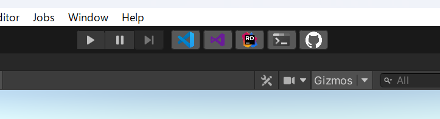
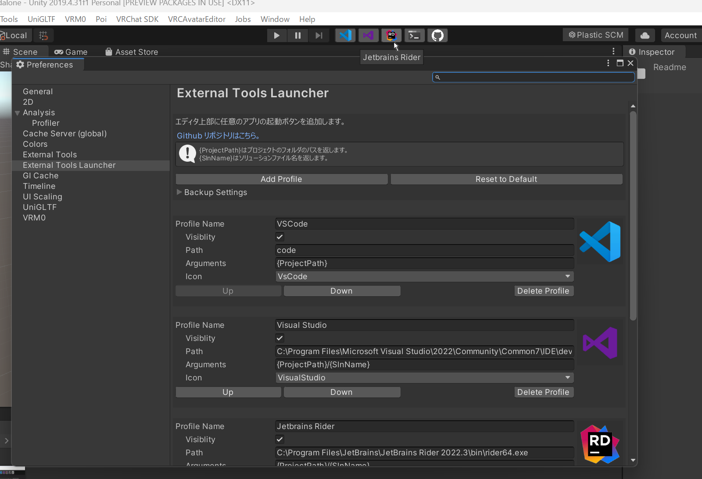

# External Tools Launcher
## 概要
Unityエディタの上部に任意のアプリの起動ボタンを追加する拡張機能です。  

## 導入
1. Unityのメニューバーから `Window` -> `Package Manager` を開く
2. Package Manager の左上にある `+` から `Add package from git URL` をクリック
3. `https://github.com/AoiKamishiro/ExternalToolsLauncher.git` をコピペして `Add` をクリック

## 使い方

1. Unity エディタ上部の再生ボタン横に各種機能が追加されます。クリックすることで開けます。

## カスタマイズ

1. Unityのメニューバーから `Editor` -> `Preferences` を開く
2. Preferencesウィンドウの左側から `External Tools Launcher` を開く
3. 各プロファイルの設定が編集できます。
  
1. ProfileName -> プロファイルの名前です。ツールチップにも表示されます。
2. Visiblity -> このプロファイルを非表示にできます。
3. Path -> 起動したいアプリケーションのパスを指定します。URLを指定することも可能です。
4. Args -> 起動オプションとなる引数を指定します。{projectPath}などの変数を利用できます。
5. Icon -> 一覧の中からアイコンを選択できます。アイコンは今後追加されていく予定です。

## ライセンス
[MIT](./LICENSE.md)

### 参考ライブラリ
[Toolbar Extender](https://github.com/marijnz/unity-toolbar-extender/tree/master/Editor)